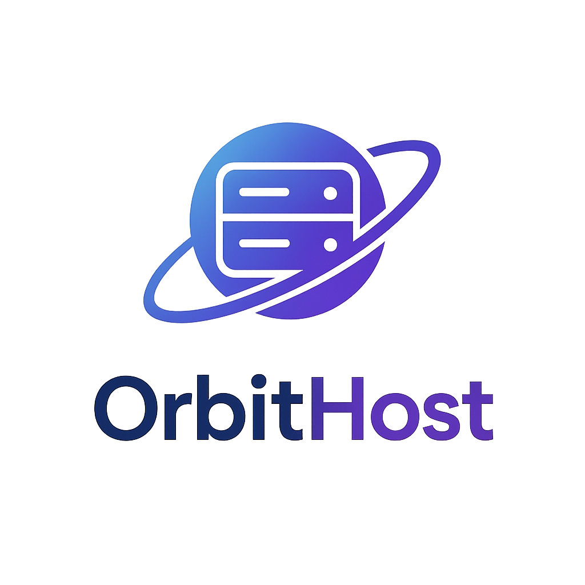

  

# 🚀 OrbitHost

---

> **Status:** 🚧 In development

---

## About the Project

**OrbitHost** is an innovative hosting management platform currently under active development.  
Our goal is to **make server hosting easier, faster, and more intuitive** for users of all levels.

We are building a **new-generation hosting experience** with modern technologies, focusing on:
- Clean and simple interfaces
- Instant server management
- Real-time status and resource tracking
- Powerful, yet user-friendly tools

This project is designed for users who want a **frictionless** and **future-ready** way to manage their game servers, websites, or cloud services.

---

## Key Features (Planned)

- 🌐 Easy-to-use hosting dashboard
- ⚡ Fast deployment and server management
- 📈 Real-time server stats (CPU, RAM, Storage)
- 🔒 Secure and scalable infrastructure
- 🎨 Modern and dynamic UI/UX

---

## Important Note

This project is **currently under active development**.  
Many features are still being built and improved.

Stay tuned for more updates! 🚀

---

## Tech Stack

- ReactJS
- SCSS (for custom styling)
- React Router
- Future integrations: API services, WebSocket for real-time updates

---

## Contributing

We are not yet open for public contributions.  
However, feedback and ideas are welcome!

---

## License

To be determined.

---

## 🚀 Slogan

_The Future of Easy Hosting_

---
